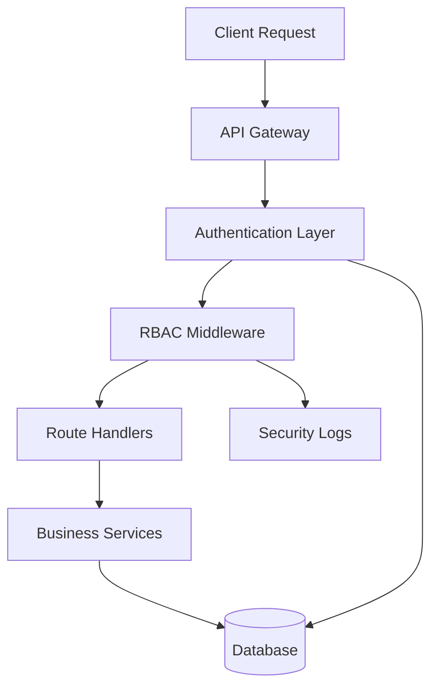
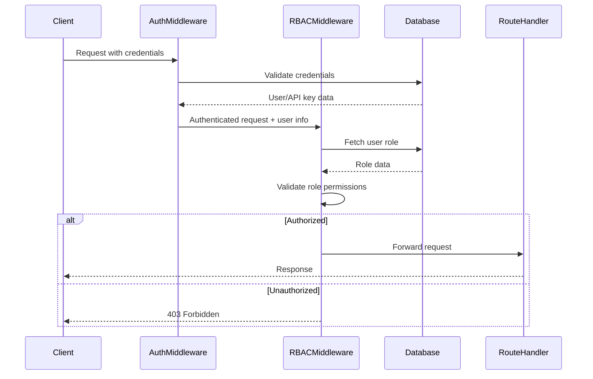

# Design Document: Role-Based Access Control (RBAC) System

## Overview

This design document specifies the technical implementation of a role-based access control (RBAC) system for Ownly. The system will enforce access control across three distinct roles (USER, BUSINESS, ADMIN) using a middleware-based architecture that integrates with existing authentication mechanisms without modifying core business logic.

### Design Goals

1. **Separation of Concerns**: Implement RBAC as middleware layer, keeping authorization separate from business logic
2. **Backward Compatibility**: Preserve all existing functionality while adding role-based restrictions
3. **Security First**: Enforce role validation at multiple layers (API gateway and service level)
4. **Extensibility**: Design for easy addition of new roles and permissions in the future
5. **Auditability**: Comprehensive logging of all access control decisions

### Key Design Decisions

- **Middleware Pattern**: Use Express middleware for role validation to avoid modifying existing route handlers
- **Database-Driven Roles**: Store roles in database to enable runtime role changes without code deployment
- **Dual Authentication**: Maintain separate authentication flows for users (JWT) and businesses (API keys)
- **Fail-Secure**: Default to denying access when role validation fails or is ambiguous
- **Layered Security**: Validate roles at both API gateway and within service methods for defense in depth

## Architecture

### System Components



### Authentication Flow



### Role Hierarchy

```
ADMIN (Full Access)
  ├── All USER permissions
  ├── All BUSINESS permissions
  └── Administrative operations
  
BUSINESS (Verification Access)
  ├── Identity verification
  ├── API access
  └── Verification results
  
USER (Personal Identity)
  ├── KYC operations
  ├── Document management
  └── QR code generation
```

## Components and Interfaces

### 1. Database Schema Extensions

#### Users Table
```sql
CREATE TABLE users (
  id UUID PRIMARY KEY DEFAULT uuid_generate_v4(),
  email VARCHAR(255) UNIQUE NOT NULL,
  role VARCHAR(20) NOT NULL DEFAULT 'user',
  supabase_user_id UUID UNIQUE,
  created_at TIMESTAMP DEFAULT NOW(),
  updated_at TIMESTAMP DEFAULT NOW(),
  last_login_at TIMESTAMP,
  status VARCHAR(20) DEFAULT 'active',
  CONSTRAINT valid_role CHECK (role IN ('user', 'business', 'admin'))
);

CREATE INDEX idx_users_email ON users(email);
CREATE INDEX idx_users_role ON users(role);
CREATE INDEX idx_users_supabase_id ON users(supabase_user_id);
```

#### API Keys Table Extension
```sql
ALTER TABLE api_keys ADD COLUMN user_id UUID REFERENCES users(id);
CREATE INDEX idx_api_keys_user_id ON api_keys(user_id);
```

#### Role Change Audit Log
```sql
CREATE TABLE role_change_log (
  id UUID PRIMARY KEY DEFAULT uuid_generate_v4(),
  user_id UUID REFERENCES users(id),
  old_role VARCHAR(20),
  new_role VARCHAR(20),
  changed_by UUID REFERENCES users(id),
  reason TEXT,
  created_at TIMESTAMP DEFAULT NOW()
);

CREATE INDEX idx_role_log_user ON role_change_log(user_id);
CREATE INDEX idx_role_log_date ON role_change_log(created_at);
```

#### Access Control Log
```sql
CREATE TABLE access_control_log (
  id UUID PRIMARY KEY DEFAULT uuid_generate_v4(),
  user_id UUID REFERENCES users(id),
  user_role VARCHAR(20),
  endpoint VARCHAR(255),
  method VARCHAR(10),
  access_granted BOOLEAN,
  reason TEXT,
  ip_address INET,
  user_agent TEXT,
  created_at TIMESTAMP DEFAULT NOW()
);

CREATE INDEX idx_access_log_user ON access_control_log(user_id);
CREATE INDEX idx_access_log_date ON access_control_log(created_at);
CREATE INDEX idx_access_log_denied ON access_control_log(access_granted) WHERE access_granted = false;
```

### 2. RBAC Middleware Component

#### Interface: `rbacMiddleware.js`

```javascript
/**
 * Role-Based Access Control Middleware
 * Validates user roles and enforces access policies
 */

// Core middleware function
export function requireRole(allowedRoles: string[]): ExpressMiddleware

// Permission checking utilities
export function hasRole(user: User, role: string): boolean
export function hasAnyRole(user: User, roles: string[]): boolean
export function hasPermission(user: User, permission: string): boolean

// Role extraction from authenticated request
export async function getUserRole(userId: string): Promise<string>
export async function enrichRequestWithRole(req: Request): Promise<void>

// Logging and auditing
export async function logAccessAttempt(
  userId: string,
  role: string,
  endpoint: string,
  granted: boolean,
  reason: string
): Promise<void>
```

#### Role Permission Matrix

| Endpoint Category | USER | BUSINESS | ADMIN |
|------------------|------|----------|-------|
| `/api/kyc/*` | ✓ | ✗ | ✓ |
| `/api/documents/*` | ✓ | ✗ | ✓ |
| `/api/identity/*` | ✗ | ✓ | ✓ |
| `/api/verify/*` | ✗ | ✓ | ✓ |
| `/api/admin/*` | ✗ | ✗ | ✓ |
| `/api/access/*` | ✓ | ✓ | ✓ |

### 3. User Service Component

#### Interface: `userService.js`

```javascript
/**
 * User Management Service
 * Handles user creation, role assignment, and user queries
 */

export interface UserService {
  // User CRUD operations
  createUser(email: string, role: string, supabaseUserId?: string): Promise<User>
  getUserById(userId: string): Promise<User>
  getUserByEmail(email: string): Promise<User>
  getUserBySupabaseId(supabaseId: string): Promise<User>
  updateUser(userId: string, updates: Partial<User>): Promise<User>
  
  // Role management
  getUserRole(userId: string): Promise<string>
  changeUserRole(userId: string, newRole: string, changedBy: string, reason: string): Promise<void>
  
  // User queries
  listUsersByRole(role: string): Promise<User[]>
  searchUsers(query: string): Promise<User[]>
}
```

### 4. Admin Service Component

#### Interface: `adminService.js`

```javascript
/**
 * Administrative Operations Service
 * Provides admin-only functionality for system management
 */

export interface AdminService {
  // User management
  listAllUsers(filters?: UserFilters): Promise<User[]>
  updateUserRole(userId: string, newRole: string, reason: string): Promise<void>
  deactivateUser(userId: string, reason: string): Promise<void>
  reactivateUser(userId: string): Promise<void>
  
  // API key management
  listAllApiKeys(): Promise<ApiKey[]>
  revokeApiKey(apiKeyId: string, reason: string): Promise<void>
  
  // Audit logs
  getAccessLogs(filters?: LogFilters): Promise<AccessLog[]>
  getRoleChangeLogs(userId?: string): Promise<RoleChangeLog[]>
  getSecurityEvents(filters?: SecurityFilters): Promise<SecurityEvent[]>
  
  // System statistics
  getUserStatistics(): Promise<UserStats>
  getApiUsageStatistics(): Promise<ApiUsageStats>
}
```

## Data Models

### User Model

```typescript
interface User {
  id: string;                    // UUID
  email: string;                 // Unique email address
  role: 'user' | 'business' | 'admin';
  supabaseUserId?: string;       // Link to Supabase auth user
  createdAt: Date;
  updatedAt: Date;
  lastLoginAt?: Date;
  status: 'active' | 'inactive' | 'suspended';
}
```

### Role Change Log Model

```typescript
interface RoleChangeLog {
  id: string;
  userId: string;
  oldRole: string;
  newRole: string;
  changedBy: string;             // Admin user ID
  reason: string;
  createdAt: Date;
}
```

### Access Control Log Model

```typescript
interface AccessControlLog {
  id: string;
  userId: string;
  userRole: string;
  endpoint: string;
  method: string;
  accessGranted: boolean;
  reason: string;
  ipAddress: string;
  userAgent: string;
  createdAt: Date;
}
```

### Permission Model

```typescript
interface Permission {
  resource: string;              // e.g., 'kyc', 'documents', 'identity'
  action: string;                // e.g., 'read', 'write', 'delete'
  roles: string[];               // Roles that have this permission
}
```

## Error Handling

### Error Response Format

```typescript
interface RBACError {
  error: string;                 // Human-readable error message
  code: string;                  // Machine-readable error code
  details?: {
    requiredRole?: string[];
    userRole?: string;
    endpoint?: string;
  };
  timestamp: string;
}
```

### Error Codes

| Code | HTTP Status | Description |
|------|-------------|-------------|
| `MISSING_AUTH` | 401 | No authentication credentials provided |
| `INVALID_AUTH` | 401 | Invalid authentication credentials |
| `MISSING_ROLE` | 403 | User has no role assigned |
| `INSUFFICIENT_ROLE` | 403 | User role lacks required permissions |
| `ROLE_VALIDATION_FAILED` | 403 | Role validation process failed |
| `INVALID_ROLE` | 400 | Attempted to assign invalid role |
| `ROLE_CHANGE_DENIED` | 403 | User not authorized to change roles |

### Error Handling Strategy

1. **Authentication Failures**: Return 401 with specific error code
2. **Authorization Failures**: Return 403 with role requirements
3. **Invalid Requests**: Return 400 with validation details
4. **System Errors**: Return 500 with generic message (log details internally)
5. **All Errors**: Log to access control log with full context

### Logging Strategy

```javascript
// Log all access denials
async function logAccessDenial(req, user, reason) {
  await logAccessAttempt(
    user.id,
    user.role,
    req.path,
    false,
    reason
  );
  
  // Alert on suspicious patterns
  if (await detectSuspiciousActivity(user.id)) {
    await alertSecurityTeam(user, reason);
  }
}

// Log all role changes
async function logRoleChange(userId, oldRole, newRole, adminId, reason) {
  await insertRoleChangeLog({
    userId,
    oldRole,
    newRole,
    changedBy: adminId,
    reason,
  });
  
  // Notify user of role change
  await notifyUserOfRoleChange(userId, newRole);
}
```

## Testing Strategy

### Unit Testing

**Focus Areas**:
- Role validation logic in middleware
- Permission checking functions
- User service CRUD operations
- Admin service operations
- Error handling and response formatting

**Example Unit Tests**:
```javascript
describe('RBAC Middleware', () => {
  test('requireRole allows access for matching role', async () => {
    const req = mockRequest({ user: { role: 'admin' } });
    const middleware = requireRole(['admin']);
    await expect(middleware(req, res, next)).resolves.not.toThrow();
    expect(next).toHaveBeenCalled();
  });
  
  test('requireRole denies access for non-matching role', async () => {
    const req = mockRequest({ user: { role: 'user' } });
    const middleware = requireRole(['admin']);
    await middleware(req, res, next);
    expect(res.status).toHaveBeenCalledWith(403);
    expect(next).not.toHaveBeenCalled();
  });
  
  test('logs access denial with correct details', async () => {
    const req = mockRequest({ user: { id: 'user-123', role: 'user' } });
    const middleware = requireRole(['admin']);
    await middleware(req, res, next);
    expect(logAccessAttempt).toHaveBeenCalledWith(
      'user-123',
      'user',
      req.path,
      false,
      expect.stringContaining('insufficient')
    );
  });
});
```

### Integration Testing

**Focus Areas**:
- End-to-end authentication and authorization flow
- Database role queries and updates
- API endpoint protection
- Cross-role access prevention
- Role change workflows

**Example Integration Tests**:
```javascript
describe('RBAC Integration', () => {
  test('USER role can access KYC endpoints', async () => {
    const token = await createUserToken('user');
    const response = await request(app)
      .get('/api/kyc/status')
      .set('Authorization', `Bearer ${token}`);
    expect(response.status).toBe(200);
  });
  
  test('USER role cannot access identity verification endpoints', async () => {
    const token = await createUserToken('user');
    const response = await request(app)
      .post('/api/identity/verify')
      .set('Authorization', `Bearer ${token}`);
    expect(response.status).toBe(403);
    expect(response.body.code).toBe('INSUFFICIENT_ROLE');
  });
  
  test('BUSINESS role with valid API key can access identity endpoints', async () => {
    const apiKey = await createBusinessApiKey();
    const response = await request(app)
      .post('/api/identity/verify')
      .set('Authorization', `Bearer ${apiKey}`)
      .send({ ownlyId: 'test-id' });
    expect(response.status).toBe(200);
  });
  
  test('ADMIN can change user roles', async () => {
    const adminToken = await createAdminToken();
    const userId = await createTestUser('user');
    const response = await request(app)
      .put(`/api/admin/users/${userId}/role`)
      .set('Authorization', `Bearer ${adminToken}`)
      .send({ role: 'business', reason: 'Upgrade to business account' });
    expect(response.status).toBe(200);
    
    // Verify role change was logged
    const logs = await getRoleChangeLogs(userId);
    expect(logs).toHaveLength(1);
    expect(logs[0].newRole).toBe('business');
  });
});
```

### Security Testing

**Focus Areas**:
- Role escalation attempts
- Cross-role access attempts
- Token/API key manipulation
- SQL injection in role queries
- Rate limiting on role-protected endpoints

**Example Security Tests**:
```javascript
describe('RBAC Security', () => {
  test('cannot escalate role by modifying JWT payload', async () => {
    const token = await createUserToken('user');
    const tamperedToken = modifyJWTRole(token, 'admin');
    const response = await request(app)
      .get('/api/admin/users')
      .set('Authorization', `Bearer ${tamperedToken}`);
    expect(response.status).toBe(401);
  });
  
  test('logs suspicious cross-role access attempts', async () => {
    const token = await createUserToken('user');
    await request(app)
      .get('/api/admin/users')
      .set('Authorization', `Bearer ${token}`);
    
    const logs = await getAccessLogs({ accessGranted: false });
    expect(logs).toContainEqual(
      expect.objectContaining({
        userRole: 'user',
        endpoint: '/api/admin/users',
        accessGranted: false,
      })
    );
  });
  
  test('prevents SQL injection in role validation', async () => {
    const maliciousRole = "admin' OR '1'='1";
    await expect(
      changeUserRole('user-123', maliciousRole, 'admin-123', 'test')
    ).rejects.toThrow('INVALID_ROLE');
  });
});
```

### Migration Testing

**Focus Areas**:
- Existing users receive correct default roles
- Existing API keys link to correct business users
- No disruption to existing functionality
- Backward compatibility with existing auth flows

**Example Migration Tests**:
```javascript
describe('RBAC Migration', () => {
  test('existing users without roles get default user role', async () => {
    await runMigration('add-user-roles');
    const users = await getAllUsers();
    users.forEach(user => {
      expect(user.role).toBeDefined();
      expect(['user', 'business', 'admin']).toContain(user.role);
    });
  });
  
  test('existing API keys link to business role users', async () => {
    await runMigration('link-api-keys-to-users');
    const apiKeys = await getAllApiKeys();
    for (const key of apiKeys) {
      const user = await getUserById(key.user_id);
      expect(user.role).toBe('business');
    }
  });
  
  test('existing KYC functionality works after migration', async () => {
    await runMigration('add-user-roles');
    const token = await createUserToken('user');
    const response = await request(app)
      .post('/api/kyc/submit')
      .set('Authorization', `Bearer ${token}`)
      .send(mockKYCData);
    expect(response.status).toBe(200);
  });
});
```

## Correctness Properties

*A property is a characteristic or behavior that should hold true across all valid executions of a system—essentially, a formal statement about what the system should do. Properties serve as the bridge between human-readable specifications and machine-verifiable correctness guarantees.*

### Property 1: Default Role Assignment

*For any* new user account created without an explicit role specification, the system SHALL assign the default role of "user".

**Validates: Requirements 1.3**

### Property 2: Single Role Invariant

*For any* user account in the system, that user SHALL have exactly one role assigned at all times.

**Validates: Requirements 1.4**

### Property 3: Role Value Validation

*For any* string value that is not one of {"user", "business", "admin"}, attempting to assign it as a role SHALL fail with a validation error.

**Validates: Requirements 1.5, 10.3**

### Property 4: Admin Universal Access

*For any* endpoint in the system, a user with Admin_Role SHALL be granted access.

**Validates: Requirements 4.1**

### Property 5: Authorization Failure Response

*For any* request where role validation denies access, the system SHALL return HTTP 403 Forbidden status.

**Validates: Requirements 5.4, 8.3**

### Property 6: Access Denial Logging

*For any* unauthorized access attempt (role validation failure or cross-role access), the system SHALL create a log entry recording the attempt.

**Validates: Requirements 5.6, 8.5, 12.1, 12.2**

### Property 7: Role Escalation Prevention

*For any* attempt to modify the role value in an authentication token or session, the system SHALL validate against the stored database value and reject mismatches.

**Validates: Requirements 6.5**

### Property 8: Non-Admin Role Management Denial

*For any* user with a role other than "admin", attempts to modify user roles SHALL be denied.

**Validates: Requirements 10.5**

### Property 9: Role Change Audit Logging

*For any* successful role modification, the system SHALL create an audit log entry containing the old role, new role, administrator identity, and timestamp.

**Validates: Requirements 10.4, 12.4**

### Property 10: API Key Storage Security

*For any* API key stored in the database, the stored value SHALL be a cryptographic hash, not the plaintext key.

**Validates: Requirements 11.2**

### Property 11: API Key Invalidation on Regeneration

*For any* API key regeneration operation, the previous API key SHALL be invalidated and no longer grant access.

**Validates: Requirements 11.6**

### Property 12: API Key Failure Logging

*For any* API key validation failure, the system SHALL create a log entry containing the Business_Role user identity and the attempted access.

**Validates: Requirements 12.3**

## Implementation Notes

### Middleware Integration Points

1. **Global Authentication**: Apply `verifyJWT` or `verifyApiKey` to all protected routes
2. **Role Enrichment**: Add `enrichRequestWithRole` after authentication
3. **Role Validation**: Apply `requireRole` to specific route groups
4. **Logging**: Ensure all RBAC decisions are logged for audit

### Migration Strategy

1. **Phase 1**: Add database schema (users table, role columns, audit logs)
2. **Phase 2**: Create user records for existing Supabase auth users with default 'user' role
3. **Phase 3**: Link existing API keys to business role users
4. **Phase 4**: Deploy RBAC middleware (initially in permissive mode for testing)
5. **Phase 5**: Enable enforcement mode and monitor logs
6. **Phase 6**: Create admin users and admin dashboard

### Performance Considerations

- **Role Caching**: Cache user roles in JWT payload to avoid database lookup on every request
- **Database Indexing**: Ensure indexes on users.role, users.email, users.supabase_user_id
- **Async Logging**: Use non-blocking logging for access control events
- **Connection Pooling**: Reuse database connections for role queries

### Security Considerations

- **Fail-Secure**: Default to denying access if role cannot be determined
- **Defense in Depth**: Validate roles at both middleware and service layers
- **Audit Everything**: Log all access decisions, especially denials
- **Rate Limiting**: Apply stricter rate limits to admin endpoints
- **Token Validation**: Always validate JWT signature and expiration before extracting role
- **SQL Injection**: Use parameterized queries for all role-related database operations

